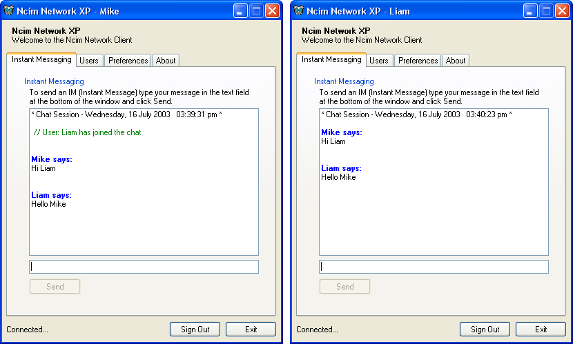



## Ncim Network XP \(Client/Server Instant Chat\)

### Description

Lets users communicate over a Network or the Internet. It uses XP visual styles and alpha blending. Please post your feedback and take the short time out to Vote.
 
### More Info
 

             |
---                |---
**Submitted On**   |2003-07-19 14:50:14
**By**             |[Mike Simmonds](https://github.com/Planet-Source-Code/PSCIndex/blob/master/ByAuthor/mike-simmonds.md)
**Level**          |Advanced
**User Rating**    |5.0 (20 globes from 4 users)
**Compatibility**  |VB 6\.0
**Category**       |[Complete Applications](https://github.com/Planet-Source-Code/PSCIndex/blob/master/ByCategory/complete-applications__1-27.md)
**World**          |[Visual Basic](https://github.com/Planet-Source-Code/PSCIndex/blob/master/ByWorld/visual-basic.md)
**Archive File**   |[Ncim\_Netwo1617387192003\.zip](https://github.com/Planet-Source-Code/mike-simmonds-ncim-network-xp-client-server-instant-chat__1-47025/archive/master.zip)

